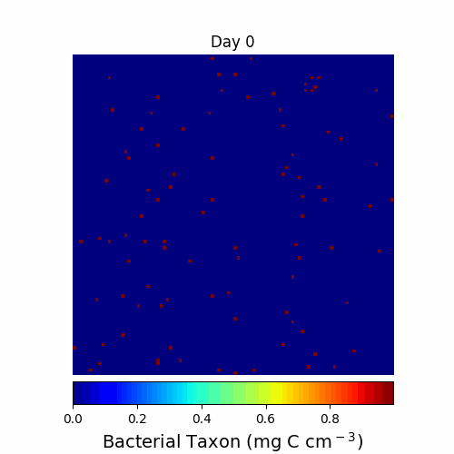

<!-- <p align="center"> <font size="6"> <b> DEMENTpy </b> </font> </p> -->

<!-- { width=30% } { width=30% } [alt text](documentation/animations/cellulose.gif "Cellulose Dynamics"){ width=30% } -->

<!--
<p align="center">
  
</p>
-->

<p align='center'>  </p>

# DEMENTpy
## A trait- and individual-based spatially explicit soil microbial systems modelling framework

``
<span style="color: red;"> [**NOTE: still under active development without any formal release of any version !!!**; if interested, feel free to reach out to me via any media] </span>
``


This model is spatially and mechanistically explicit in simulating a microbial system comprised of a large number of hypothetical microbial taxa in terrestial environments. As indicated by the 'py' in its name, DEMENTpy is developed and programmed in Python, based on its predecesor DEMENT that is R-based instead.

### Vision

DEMENTpy, initiated with in mind practicing **Real Open Science**, is devoted to 100% OPEN SOURCE and longterm maintanence and development, which, however, will not be limited to ourselves but sincerely seek inputs from the communities that could be as broad as microbial ecology, systems biology, theoretical ecology, etc. Just because of community inputs, please read closely our statement on **policies and rules** of making contributions to DEMENTpy or applying it to your own research.

### Structure and Process

This model is built upon its predecessor--DEMENT, an R-based framework initially developed by Steven Allison back in 2012. Except for the programming language change, a series of changes have been made with an overarching goal of making it more readily accessible to the research and teaching communities as broad as microbial ecology, theoretical ecology, and ecosystem ecology, as well as biology. This model simulates processes ranging from degradation of substrates through microbial processes encompassing uptake, metabolism, mortality, reproduction, and dispersal in a spatially explicit, mechanistically explicit fashion. Here is the underlying conceptual structure of DEMENTpy. For more detailed information about DEMENTpy, we refer readers/users to the **Documentation**(in pdf) archived in the documentation/ folder. 


### Run DEMENTpy

**Get the code**:
```shell
git clone https://github.com/bioatmosphere/DEMENTpy
```

**Directory structure**:

- src/: all source code

- input/: data required to drive the model

- output/: folder where the output object in .pickle will be residing

**Run DEMENTpy**:

- Configure Environment
- - Python >= 3.7
- - Numpy >= 1.16.4
- - Pandas >= 0.24.2

A simple example of bash script, dementpy.sh, for running jobs on HPC is provided.

### Contributing Guide

Please follow these rules if you want to contribute to this open source project:

It is coming soon!

### License

[MIT LICENSE](https://github.com/bioatmosphere/DEMENTpy/blob/master/LICENSE)

### References

1. Wang, B., & Allison, S. D. (2019).[Emergent properties of organic matter decomposition by soil enzymes](https://doi.org/10.1016/j.soilbio.2019.107522). Soil Biology and Biochemistry, 136, 107522.

2. Allison, S. D., & Goulden, M. L. (2017). [Consequences of drought tolerance traits for microbial decomposition in the DEMENT model](https://doi.org/10.1016/j.soilbio.2017.01.001). Soil Biology and Biochemistry, 107, 104-113.

3. Allison, S. D. (2012). [A trait‐based approach for modelling microbial litter decomposition](https://doi.org/10.1016/j.soilbio.2017.01.001). Ecology letters, 15, 1058-1070. 